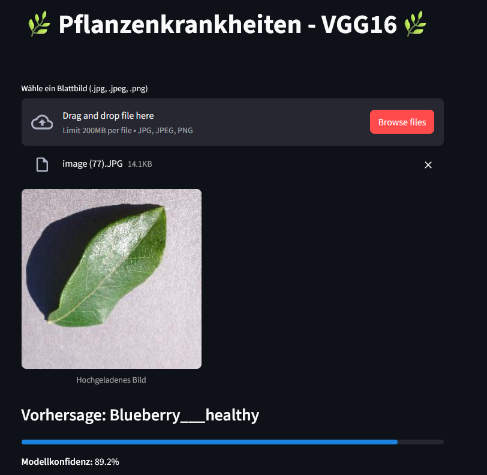

# Pflanzenkrankheiten-Klassifikator mit VGG16 und Streamlit UI

Dieses Projekt nutzt ein **Transfer-Learning-Modell (VGG16)**, um Pflanzenkrankheiten anhand von Blattbildern zu erkennen. Eine interaktive Benutzeroberfläche (GUI) mit [Streamlit](https://streamlit.io/) ermöglicht es, Bilder hochzuladen und Vorhersagen in Echtzeit zu erhalten.

## Funktionen
- Deep-Learning-Modell auf Basis von VGG16 (Keras)
- Bilderkennung für **38 Klassen von Pflanzenkrankheiten**
- Webbasierte Benutzeroberfläche mit Taipy
- Ausgabe der vorhergesagten Klasse und Wahrscheinlichkeit


## Anforderungen & Einrichtung

### Virtuelle Umgebung mit `.venv` einrichten

```bash
# 1. Virtuelle Umgebung erstellen
python -m venv .venv

# 2. Umgebung aktivieren
# Windows:
venv\Scripts\activate
# macOS/Linux:
source venv/bin/activate

# 3. Abhängigkeiten installieren
pip install -r requirements.txt
````

## Projekt starten

1. Modell lautet: `best_model.keras`.
2. Starte die Anwendung:

```bash
streamlit run app.py
```

## Projektstruktur

```
.
├── app.py                # Hauptskript mit Taipy GUI
├── best_model.keras      # VGG16-Modell (trainiert)
├── requirements.txt      # Paketabhängigkeiten
├── README.md             # Diese Dokumentation
├── logo.png              # Optionales Logo für die GUI
└── venv/                 # Virtuelle Umgebung
```

## Beispielausgabe


## App in Streamlit Cloud


## Referenzen

- Trainiert mit dem nich augmentierten [Datensatz](https://data.mendeley.com/datasets/tywbtsjrjv/1)

- Transfer Learning - VGG16 aus dem [Blog](https://towardsdatascience.com/transfer-learning-with-vgg16-and-keras-50ea161580b4/)

- Inspiriert von Taipy GUI [Repository](https://github.com/MariyaSha/ml_gui_app)

- Host Anwendung in [Cloud](https://streamlit.io/cloud)